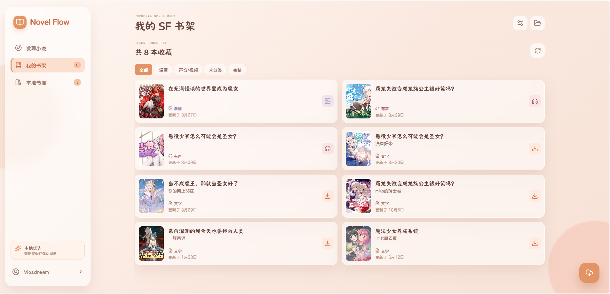
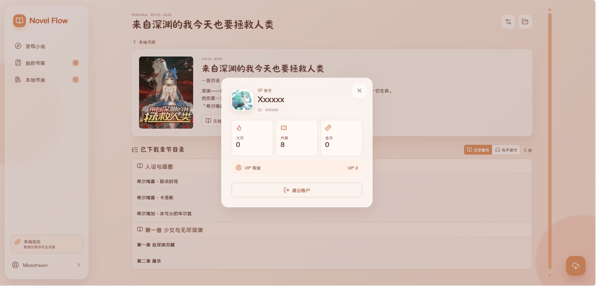
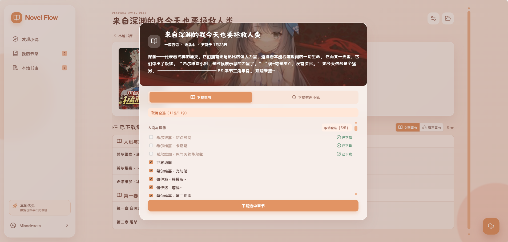
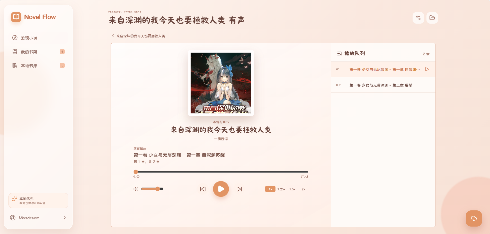

# 🍍 Novel Flow


<p align="center">
  <span>一个优雅的菠萝包轻小说平台的阅读与下载工作台</span>
  <br/>
  <span>基于 Vue 3、Express 和 TypeScript 构建，连接菠萝包轻小说，整理文字与有声内容</span>
</p>

<p align="center">
  <a href="https://nodejs.org/">= 18.17" src="https://img.shields.io/badge/Node.js-%3E%3D18.17-brightgreen?style=flat-square&logo=node.js"></a>
  <a href="https://vuejs.org/"></a>
  <a href="https://expressjs.com/"></a>
  <a href="https://www.typescriptlang.org/"></a>
  <a href="./package.json"></a>
</p>

<p align="center">
  <a href="#-项目简介">项目简介</a> •
  <a href="#-核心特性">核心特性</a> •
  <a href="#-项目截图">项目截图</a> •
  <a href="#-快速开始">快速开始</a> •
  <a href="#-项目结构">项目结构</a> •
  <a href="#-开发路线">开发路线</a>
</p>

---

## 📋 项目简介

**Novel Flow** 是一个面向个人使用的菠萝包轻小说本地阅读工作台。它把在线搜索、账号书架、章节下载、本地阅读、有声播放和内容导出整合到一个简洁的 Web 界面中。

Novel Flow 的目标是让小说内容从“发现”到“保存”再到“阅读”保持连贯：下载任务在本地排队执行，完成后的作品进入自己的书库，文字和音频都可以脱离在线目录继续使用。

> [!WARNING]
> 频繁请求接口可能导致账号出现风控提醒，需要手动在手机端验证，使用造成的后果自行承担。

### 🎯 项目愿景

打造一个**本地优先、阅读舒适、下载可控**的个人小说空间：

- 📚 更方便地发现和整理喜欢的作品
- 📝 将已下载章节保存为可长期管理的本地文件
- 🎧 在同一书库中管理文字和有声内容
- 🛡️ 通过官方登录流程保护账号凭证
- ⚙️ 让请求间隔、并发数和下载队列都可控

## ✨ 核心特性

### 🔎 作品发现

- **作品搜索** - 按书名、作者或关键词搜索菠萝包轻小说作品
- **详情与目录** - 查看作品简介、作者、封面、分卷和章节状态
- **今日推荐** - 首页展示随机推荐封面，每次刷新都可能看到不同作品

### 📥 章节下载

- **文字下载** - 按卷或按章节选择内容，保存为 Markdown 及本地章节数据
- **有声下载** - 获取有声目录，下载 MP3 并生成本地播放列表
- **断点续下** - 已下载章节会被标记，失败或暂停的任务可以继续执行
- **下载队列** - 查看进度，暂停、恢复、取消或删除任务

### 📖 本地书库

- **本地阅读器** - 直接阅读已经保存的文字章节，不依赖在线章节接口
- **有声播放器** - 浏览本地音轨，切换章节并连续播放
- **作品详情** - 统一查看作者、简介、封面、文字章节和音频资源
- **多格式导出** - 文字可导出 EPUB、TXT、Markdown ZIP；有声内容可导出 ZIP

### 👤 账号与请求管理

- **官方网页登录** - 在独立的 Chrome 官方登录窗口中完成登录和滑块验证
- **书架同步** - 查看、刷新已登录 SF 账号的个人书架，并按分类浏览
- **会话保护** - 应用只保留本机 HttpOnly 会话 Cookie，不保存账号密码
- **请求策略** - 自定义请求间隔和最大并发下载数

## 🎨 项目截图

<table>
  <tr>
    <td></td>
    <td></td>
  </tr>
  <tr>
    <td></td>
    <td></td>
  </tr>
  <tr>
    <td></td>
    <td></td>
  </tr>
</table>

## 🚀 快速开始

### 📦 环境要求

| 软件    | 版本      | 说明                |
| ------- | --------- | ------------------- |
| Node.js | ≥ 18.17.0 | JavaScript 运行环境 |

### 💻 安装与运行

#### 从源码运行

1. **安装依赖**

   ```bash
   npm install
   ```

2. **启动开发模式**

   ```bash
   npm run dev
   ```

   开发模式会同时启动 Web 开发服务器和 API 服务：
   - Web：<http://127.0.0.1:5173>
   - API：<http://127.0.0.1:8787>

   浏览器打开 Web 地址即可使用。Vite 会把 `/api` 和 `/library` 请求代理到本地 API 服务。

3. **构建并运行生产页面**

   ```bash
   npm run build
   npm run server
   ```

   然后访问 <http://127.0.0.1:8787>。Express 会同时提供构建后的前端页面、API 和本地书库资源。

## ⚙️ 配置

项目根目录的 [`config.json`](./config.json) 保存本地书库与下载策略：

```json
{
  "userSettings": {
    "libraryDir": "output/菠萝包轻小说"
  },
  "requestPolicy": {
    "requestIntervalMs": 250,
    "maxConcurrentDownloads": 1
  }
}
```

| 配置项                                 | 说明                                                           |
| -------------------------------------- | -------------------------------------------------------------- |
| `userSettings.libraryDir`              | 本地书库目录。相对路径以项目根目录为基准，也可以填写绝对路径。 |
| `requestPolicy.requestIntervalMs`      | 下载请求间隔，单位为毫秒。也可以在页面请求设置中修改。         |
| `requestPolicy.maxConcurrentDownloads` | 同时执行的下载任务数。建议保持较低值，避免对上游服务造成压力。 |

默认端口为 Web 开发模式的 `5173` 和 API/生产服务的 `8787`，分别定义在 [`vite.config.ts`](./vite.config.ts) 和 [`src/server/config.ts`](./src/server/config.ts)。

## 📂 项目结构

```text
auto-novel/
├── docs/
│   ├── image/                  # README 头图和界面截图
│   ├── SFACG-APP-API.md        # App API 签名、登录与章节下载验证
│   └── SFACG-AUDIO-API.md      # 有声接口、认证与安全说明
├── src/
│   ├── web/                    # Vue 3 前端
│   │   ├── components/         # 登录、章节选择、队列、导出等组件
│   │   ├── pages/              # 搜索、书架、本地书库、阅读器、播放器
│   │   └── composables/        # 前端状态与 API 调用
│   ├── server/                 # Express API 与下载服务
│   │   ├── infrastructure/    # SFACG HTTP 客户端与数据适配
│   │   ├── routes/             # 认证、目录、任务、书库和设置路由
│   │   └── services/           # 下载、缓存、EPUB、书库、会话服务
│   ├── client/                 # 预留的旧版 SF 自动化与工具代码
│   └── server.ts               # 本地 API 服务入口
├── output/                    # 默认下载书库（已忽略，不提交）
├── config.json                # 本地书库及下载策略配置
├── vite.config.ts             # Vite 配置与本地代理
└── package.json
```

## 🎯 开发路线

### ✅ 已完成功能

- [x] 作品搜索、详情与文字目录
- [x] 浏览器登录
- [x] SF 书架同步与分类分页
- [x] 文字、有声下载和下载队列
- [x] 本地阅读器与有声播放器
- [x] EPUB、TXT、Markdown 和音频导出
- [x] 下载请求策略配置

### 🔄 预留模块

- [ ] 自动签到
- [ ] 更多内容类型与下载能力

## 📄 许可证

本项目采用 GPL3.0 License。项目仅供学习和研究，不得用于非法用途。

## 🙏 致谢

[LanBaiCode/auto-novel](https://github.com/LanBaiCode/auto-novel) ：提供部分api接口
[Oevani/Sfacg_Downloader](https://github.com/Oevani/Sfacg_Downloader) : 提供部分api接口,及签名方案

---

<p align="center">
  Made for a quiet personal reading space · Novel Flow
</p>

<p align="center">
  <a href="#-novel-flow">⬆ 返回顶部</a>
</p>
